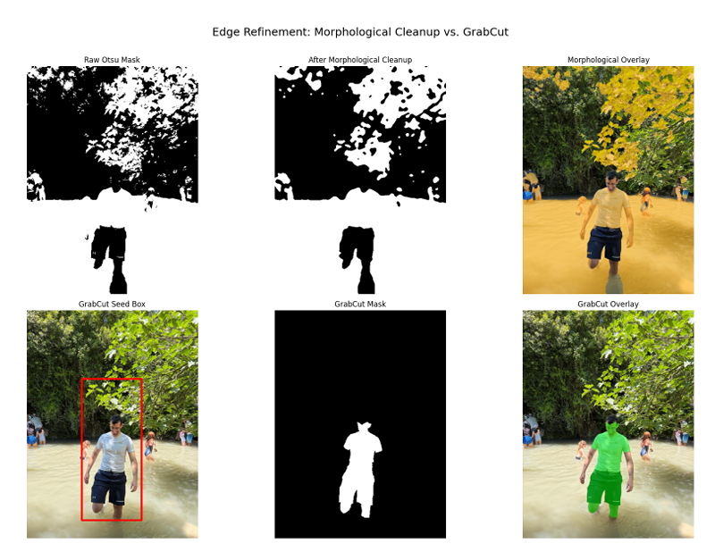
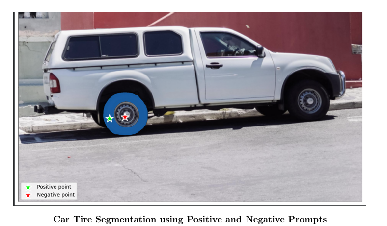
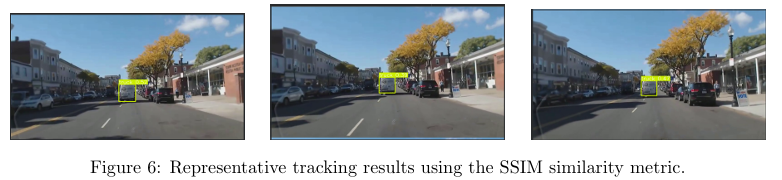
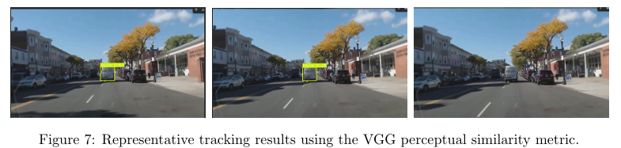

# Segmentation-Detection-and-Tracking

Computer Vision project covering classical and deep learning approaches for image segmentation, object detection, and tracking.

## Overview

This project explores multiple computer vision techniques across three main tasks:

- Classical vs. Deep Learning Semantic Segmentation
- Segment Anything Model (SAM)
- YOLO-based Object Detection and Tracking

The project was completed as part of the Computer Vision course at the Technion.

---

## Methods

### Semantic Segmentation

- Mean Shift Clustering
- DeepLabV3
- Morphological Refinement
- GrabCut

### Segment Anything Model (SAM)

- Point-based prompting
- Positive and negative prompts
- Medical image fine-tuning

### Object Detection and Tracking

- YOLO
- Similarity-based tracking using SSIM
- Similarity-based tracking using VGG features

---

## Repository Structure

```text
.
├── notebook.ipynb
├── report.pdf
├── requirements.txt
├── README.md
│
├── data/
│   ├── provided/
│   └── custom/
│
├── figures/
│
└── yolo/
    └── models.py
```

---

## Results

### Classical vs Deep Learning Segmentation


### Custom Image Segmentation


### Edge Refinement with GrabCut



### SAM Prompting




### SAM Fine-Tuning on Medical Images


### YOLO Tracking





---

## Data

The original assignment provided the datasets as compressed archives.

For convenience, the relevant files were extracted and organized under the `data/` directory.

- `data/provided` contains course-provided resources.
- `data/custom` contains images used for the custom segmentation experiment.

---

## Authors

- Omer Lugasi
- Aviv Osher Benyamin